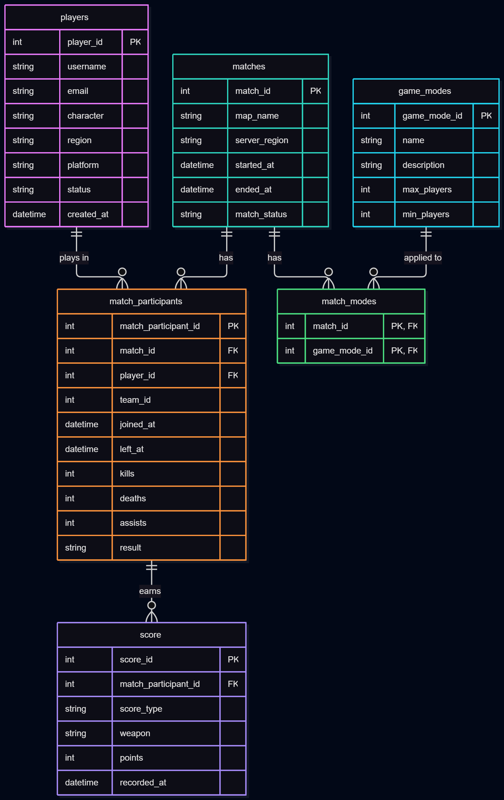

# Terminator Wars - Game Telemetry System

The Terminator Wars Game Telemetry System analyzes gameplay data to identify player trends to help make descisions in future releases of the game

## Chosen theme: 
 - Game Telemetry system

## Domain: 
The Terminator Wars Game Telemetry System is a data analytics platform designed to collect and analyze gameplay data from Terminator Wars, a first-person shooter based on the Terminator movies. In the game, players take on the roles of Terminator characters and compete on teams against one another across different game modes. Players can use weapons and play on maps inspired by locations and scenes from the Terminator movies. The telemetry system will collect information about how players interact with different aspects of the game.

The primary purpose of the platform is to provide insights that can be used to guide future game development and releases. The system must answer questions such as which maps are the most and least popular, which weapons are used most frequently, and which Terminator characters players prefer. It should also identify trends in player behavior across different game modes and determine whether certain maps, weapons, or characters are associated with higher levels of player engagement. By answering these questions, the telemetry system can help developers make informed decisions about which content to expand, improve, modify, or potentially replace in future versions of the game.

Ultimately, the platform should turn raw gameplay telemetry into useful information for the development team. Rather than relying solely on player opinions or assumptions, developers can use actual gameplay data to determine what content players are engaging with and what content may be underperforming.

## Entity Relation Diagram:

