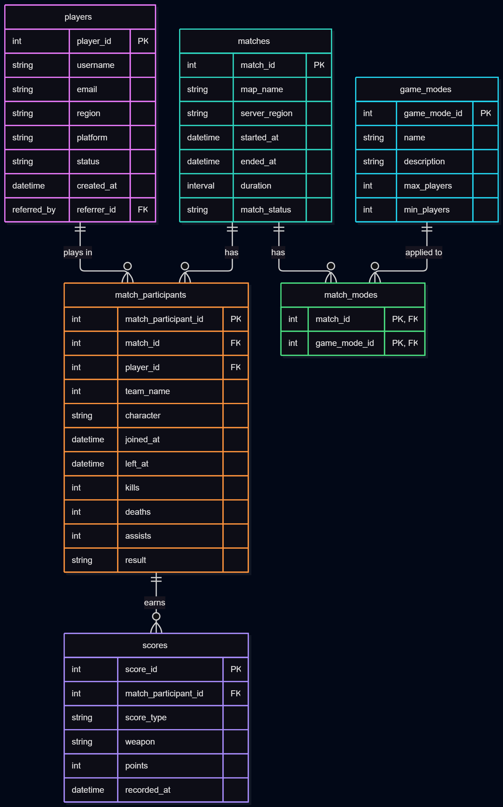

# Terminator Wars - Game Telemetry System

The Terminator Wars Game Telemetry System analyzes gameplay data to identify player trends to help make descisions in future releases of the game

## Chosen theme: 
 - Game Telemetry system

## Domain: 
The Terminator Wars Game Telemetry System is a data analytics platform designed to collect and analyze gameplay data from Terminator Wars, a first-person shooter based on the Terminator movies. In the game, players take on the roles of Terminator characters and compete on teams against one another across different game modes. Players can use weapons and play on maps inspired by locations and scenes from the Terminator movies. The telemetry system will collect information about how players interact with different aspects of the game.

The primary purpose of the platform is to provide insights that can be used to guide future game development and releases. The system must answer questions such as which maps are the most and least popular, which weapons are used most frequently, and which Terminator characters players prefer. It should also identify trends in player behavior across different game modes and determine whether certain maps, weapons, or characters are associated with higher levels of player engagement. By answering these questions, the telemetry system can help developers make informed decisions about which content to expand, improve, modify, or potentially replace in future versions of the game.

Ultimately, the platform should turn raw gameplay telemetry into useful information for the development team. Rather than relying solely on player opinions or assumptions, developers can use actual gameplay data to determine what content players are engaging with and what content may be underperforming.

## Entity Relation Diagram:

## Schema

The database is defined in [schema/schema.sql](schema/schema.sql) and targets PostgreSQL 18.

### Tables

| Table | What it holds | Key |
|---|---|---|
| `players` | One row per player account: username, email, region, platform, account status and an optional referrer. | `player_id` |
| `matches` | One row per match: map, server region, start/end times, a derived duration and the match's lifecycle status. | `match_id` |
| `game_modes` | Gameplay modes (Team Deathmatch, Capture the Flag, Search and Destroy, Domination) with player limits. | `game_mode_id` |
| `match_participants` | One row per player per match: team, character, join/leave times, kills, assists, deaths and result. Resolves the many-to-many between `players` and `matches`. | `match_participant_id` |
| `match_modes` | Links matches to the game modes they were played under. Resolves the many-to-many between `matches` and `game_modes`. | `(match_id, game_mode_id)` |
| `scores` | Individual scoring events earned by a participant (kill, headshot, flag capture, …), with the weapon used and points awarded. | `score_id`  |

### Design decisions worth noticing

- **Match history outlives player accounts.** `match_participants.player_id` is nullable and uses `ON DELETE SET NULL`. If an account is removed, that player's kills, deaths and scores stay in the match, so team totals and scoreboards for everyone else in that match don't change. Accounts are normally soft-deleted by setting `status = 'inactive'`, and hard deletes are reserved for maintenance.
- **Match data is purged as a unit.** Deleting a match cascades to its participants, its `match_modes` rows and, through participants, to their scores. Old telemetry, for example from a previous game version, can be removed with a single `DELETE FROM matches ...`.
- **Referrals are a recursive foreign key.** `players.referrer_id` references `players.player_id`. It uses `SET NULL`, so deleting a referrer never deletes the players they brought in.
- **`match_modes` is a weak entity.** It has no attributes of its own. Its identity is the composite key of its two owners, and it cascades away if either the match or the game mode is deleted.
- **Scores are a separate table rather than a list on the participant.** A participant can earn many scoring events of the same type in one match, so `scores` resolves what would otherwise be a multivalued attribute and uses its own surrogate key.
- **`duration` is derived, not entered.** `matches.duration` is `GENERATED ALWAYS AS (ended_at - started_at) STORED`. It is computed once when the match ends and read often by analysis queries, so it is stored rather than recalculated. Because it can't be written directly, it can never disagree with the timestamps.